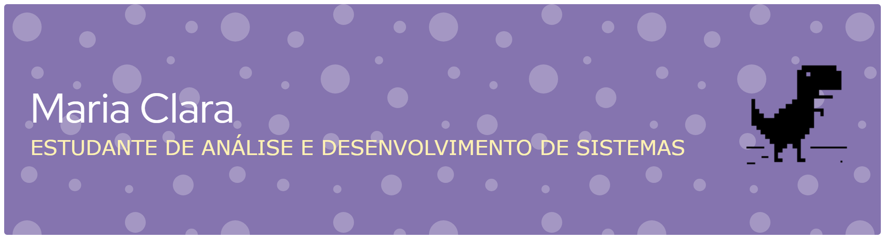

<!-- BANNER -->

  

<!-- LINKEDIN -->

---

🎓 Estudante de **Análise e Desenvolvimento de Sistemas**

💻 Aprendendo **Python, HTML, CSS e JavaScript**

🚀 Desenvolvendo projetos e evoluindo constantemente

---

## 💜 Sobre mim

Olá! Eu sou **Maria Clara Ramos**, estudante de **Análise e Desenvolvimento de Sistemas** e apaixonada por tecnologia.

Atualmente estou desenvolvendo meus conhecimentos em programação e desenvolvimento web, explorando novas tecnologias e colocando meus conhecimentos em prática através de projetos.

🎯 Meu objetivo é continuar evoluindo na área de tecnologia e me tornar uma **desenvolvedora**.

---

## 💜 Tecnologias e Ferramentas

---

## 📊 Estatísticas do GitHub

---

## 🐍 Minhas contribuições

---

## 🌷 Atualmente

* 💻 Estudando programação e desenvolvimento web
* 📚 Aprendendo novas tecnologias
* 🛠️ Desenvolvendo projetos para praticar meus conhecimentos
* 🚀 Construindo meu portfólio
* 🎯 Buscando evoluir profissionalmente na área de tecnologia

---

---

